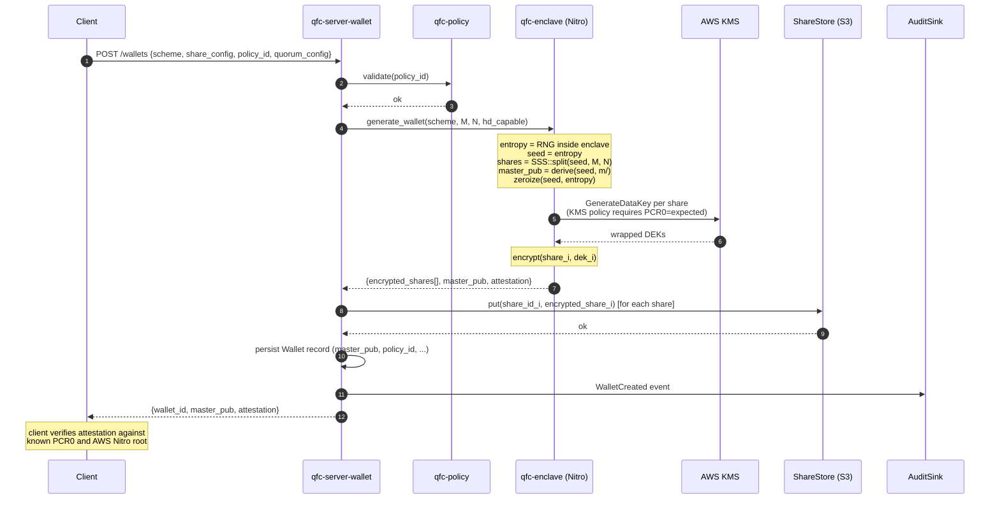
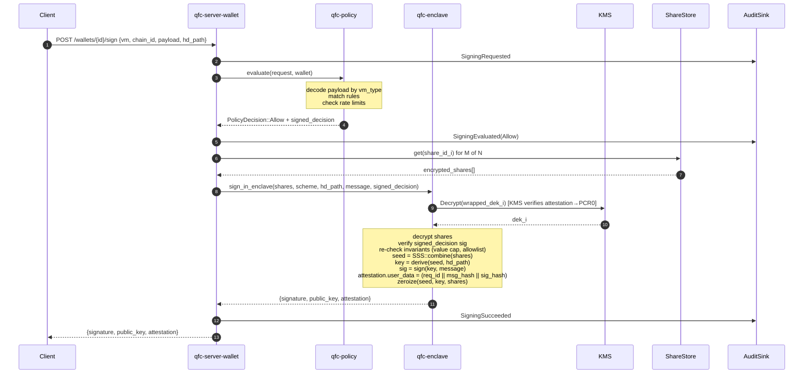
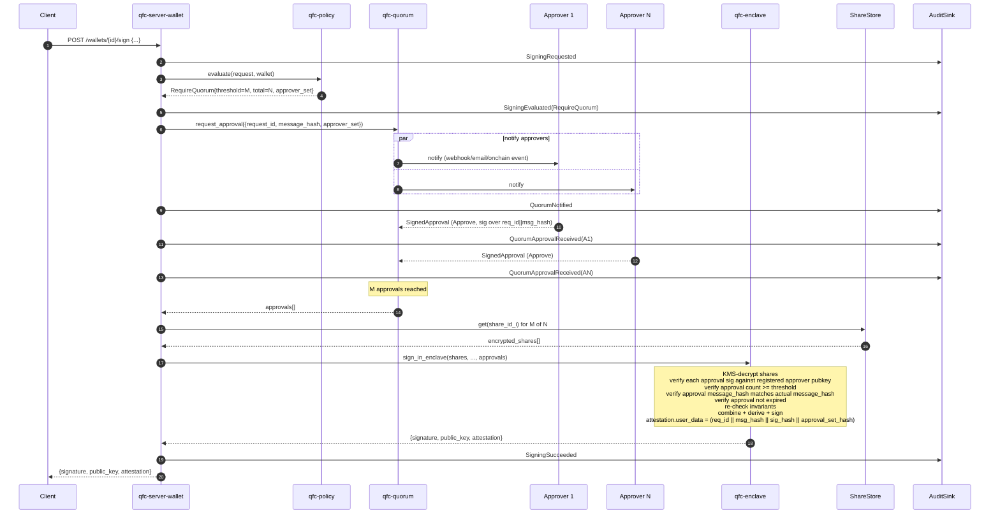

# RFC: QFC Server Wallet (Privy-style TEE custody + M-of-N quorum)

**Status:** v1.0 — accepted
**Author:** Claude (drafted for Larry)
**Date:** 2026-05-19 (v0.1) · 2026-05-19 (v1.0, decisions applied)
**License of this doc:** Apache 2.0 (will live in public repo `qfc-server-wallet`)

**Changelog**
- v0.1 (2026-05-19) — initial draft, 11 open decisions in §10
- v1.0 (2026-05-19) — decisions resolved by Larry; §10 rewritten as "Resolved decisions"; §9.6 rewritten with honest QVM/WASM ABI assessment from qfc-core code inspection; M5 scope adjusted accordingly; §12 "Repo bootstrap checklist" added

---

## 0. Scope & non-goals

In scope:
- Server-side wallet subsystem for programmable treasury, agent wallets, enterprise approval flows
- TEE-isolated key custody, SSS sharding, declarative policy, M-of-N quorum, audit log
- Nitro Enclaves as reference TEE backend; trait-abstracted for SGX/TDX/Mock
- secp256k1 + ed25519 from M1; Dilithium / ML-DSA placeholder from M1, implementation in M5
- Multi-VM policy decoders: EVM, QVM, WASM
- Reproducible enclave image build

Out of scope:
- Client-side wallets (`qfc-wallet`, `qfc-wallet-desktop`, `qfc-wallet-mobile` cover these)
- Custodial UX (login, KYC, recovery flows) — those layer on top, separate product
- Cross-chain bridging (`qfc-bridge` covers it)
- HSM-replacement for chain validators (different threat model)

---

## 1. Crate layout

### 1.1 New repo: `qfc-server-wallet` (public, Apache 2.0)

Cargo workspace with six crates:

```
qfc-server-wallet/
├── Cargo.toml                       # workspace root
├── crates/
│   ├── qfc-server-wallet/           # binary + top-level lib (HTTP/gRPC API)
│   ├── qfc-enclave/                 # TEE trait + MockEnclave + NitroEnclave backends
│   ├── qfc-sss/                     # SSS wrapper + ShareStore trait + backends
│   ├── qfc-policy/                  # Policy DSL + evaluator + EVM/QVM/WASM decoders
│   ├── qfc-quorum/                  # M-of-N approver coordination
│   └── qfc-audit/                   # AuditSink trait + Postgres/Kafka/file backends
├── enclave/
│   ├── Dockerfile.eif               # reproducible Nitro EIF build
│   ├── boot.rs                      # in-enclave binary entrypoint
│   └── kbuild.lock                  # pinned kernel/initramfs versions for reproducibility
├── docs/
│   ├── server-wallet-rfc.md         # this doc
│   ├── threat-model.md
│   ├── attestation.md
│   └── policy-dsl.md
├── examples/
│   └── policies/                    # sample policy configs
├── deny.toml                        # cargo-deny config
├── SECURITY.md                      # disclosure policy
├── LICENSE                          # Apache 2.0
└── NOTICE
```

### 1.2 Sister private repo: `qfc-server-wallet-ops`

```
qfc-server-wallet-ops/               # private
├── terraform/                       # AWS infra (Nitro EC2, KMS, S3, RDS, MSK)
├── kms/                             # KMS key policies, attestation conditions
├── runbooks/                        # incident response (redacted version may land in public docs/)
└── policies/                        # production customer policies (encrypted at rest)
```

### 1.3 Why six crates (not three, not one)

| Crate | Why separate |
|-------|--------------|
| `qfc-server-wallet` | Top-level binary; can be replaced by integrators with their own API surface (gRPC vs HTTP vs in-process embed) |
| `qfc-enclave` | TEE abstraction is the hardest-to-test piece; isolating it lets us swap backends and run the rest of the system against `MockEnclave` |
| `qfc-sss` | SSS layer + ShareStore is a clean abstraction; integrators may want to plug their own storage (Vault, custom HSM) without touching enclave code |
| `qfc-policy` | Policy DSL is the most product-touching surface; tight iteration loop, deserves its own version cadence and test surface |
| `qfc-quorum` | Approver coordination is async/networked logic; very different test profile from the rest (needs mock notification channels) |
| `qfc-audit` | Audit sink is the most likely thing integrators replace (their existing SIEM, their existing event bus) |

Three-crate or one-crate layouts make the binary monolithic and force integrators to fork to customize any single piece. Six is the smallest split that gives meaningful seams.

### 1.4 Dependencies on `qfc-core`

Must depend on:
- `qfc-types` — `Address`, `Hash`, `PublicKey`, `Signature` (reuse types across the ecosystem)
- `qfc-crypto` — `Keypair`, `verify_signature` for ed25519 baseline

**Decision (v1.0):** `qfc-types` and `qfc-crypto` ship on **public crates.io**. This requires a small piece of preparatory work in `qfc-core`:
- Add `[package].publish = true`, populate `description`, `documentation`, `repository`, `readme`, `keywords`, `categories`
- Adopt a public semver policy (likely `0.x` until the first stable cut)
- Add a release workflow (tag → `cargo publish` with `--token`-from-secret), with order: `qfc-types` → `qfc-crypto` (crypto depends on types)
- During the interim (before first publish), `qfc-server-wallet` uses a **git dep pinned to a commit hash**, replaced with a crates.io version dep before the M1 tag.

### 1.5 Crate selection — third-party

| Need | Crate | Why |
|------|-------|-----|
| Async runtime | `tokio` (1.x, multi-thread) | de facto standard, matches rest of qfc ecosystem |
| HTTP server | `axum` | tower-compatible, easy middleware for auth/tracing, low overhead |
| gRPC (later) | `tonic` | most mature pure-rust gRPC |
| SSS | `vsss-rs` | active maintenance, supports Shamir + Feldman + Pedersen VSS (matters for future verifiable shares without library swap), no_std friendly (will run inside enclave) |
| secp256k1 | `k256` (RustCrypto) | pure rust, audited, no FFI surface for the enclave |
| ed25519 | `ed25519-dalek` | already used in qfc-crypto |
| BIP32/BIP39 | `bip32` + `bip39` (RustCrypto) | pure rust; HD derivation runs inside enclave |
| PQ (M5) | `pqcrypto-dilithium` (NIST ML-DSA / FIPS 204) | NIST-standardized, pure-Rust wrappers around ref implementation. Avoid `oqs-rs` for enclave — pulls in liboqs C lib, complicates reproducible builds |
| Nitro SDK | `aws-nitro-enclaves-nsm-api` + `aws-nitro-enclaves-attestation` | official AWS crates; thin and audited |
| Vsock IPC | `tokio-vsock` | host↔enclave channel |
| KMS | `aws-sdk-kms` | for share encryption-at-rest |
| Attestation parsing | `aws-nitro-enclaves-cose` + `coset` | COSE_Sign1 verification |
| Audit storage | `sqlx` (Postgres) + `rdkafka` (optional) | tracing-compatible, async |
| Policy serialization | `serde` + `serde_json` for v1; consider `protobuf` if cross-language clients emerge | start simple |
| Tracing | `tracing` + `tracing-subscriber` + `tracing-opentelemetry` | matches existing qfc stack |
| Metrics | `metrics` + `metrics-exporter-prometheus` | Mimir-compatible (matches existing infra) |
| Testing | `proptest`, `tokio-test`, `wiremock`, `testcontainers` | property tests for policy engine; integration tests for enclave/store |
| Build hygiene | `cargo-deny`, `cargo-vet`, `cargo-audit` | mandatory in CI |

Crates explicitly rejected:
- `sharks` (SSS) — too basic, no verifiable variants, would need swap-out later
- `secp256k1` (libsecp256k1 FFI) — FFI from inside enclave complicates reproducible build; `k256` is fast enough
- `openssl` — pulls in libssl, terrible for enclave attack surface; we use `rustls` if TLS is needed

---

## 2. Core traits

All traits `Send + Sync + 'static` and use `async_trait` until rust-lang stabilizes async-in-traits enough for object safety (likely 2026 stable, will migrate).

### 2.1 `Enclave`

The TEE boundary. Everything inside `sign_in_enclave` runs in a memory-isolated environment; key shares enter as encrypted blobs that only the enclave's KMS-granted policy can decrypt.

```rust
// crates/qfc-enclave/src/lib.rs
#[async_trait]
pub trait Enclave: Send + Sync {
    /// Returns the enclave's measurement (PCR0..PCR4 for Nitro) and a fresh
    /// attestation document binding the enclave identity key to those PCRs.
    /// The nonce is included in the attestation to prevent replay.
    async fn attest(&self, nonce: [u8; 32]) -> Result<AttestationDoc, EnclaveError>;

    /// Reconstruct the secret from M-of-N shares INSIDE the enclave, derive
    /// the requested HD path (if applicable), sign the message under the given
    /// scheme, and return the signature plus an attestation that binds:
    ///   (request_id, message_hash, signature_hash, scheme, public_key, hd_path)
    /// to the enclave identity key.
    async fn sign_in_enclave(
        &self,
        req: EnclaveSignRequest,
    ) -> Result<EnclaveSignResponse, EnclaveError>;

    /// Generate a new master seed inside the enclave, split it via SSS,
    /// encrypt each share under a different recipient public key (typically
    /// KMS-wrapped per ShareStore backend), and return the encrypted shares
    /// + the derived public key for the requested HD path (usually m/).
    /// The master seed is zeroized before this function returns.
    async fn generate_wallet(
        &self,
        req: GenerateWalletRequest,
    ) -> Result<GenerateWalletResponse, EnclaveError>;
}

pub struct EnclaveSignRequest {
    pub request_id: RequestId,
    pub shares: Vec<EncryptedShare>,    // already fetched from ShareStore
    pub threshold: u8,
    pub scheme: SigningScheme,
    pub hd_path: Option<HdPath>,        // None = sign with master key directly
    pub message: Vec<u8>,               // raw bytes to sign (caller hashes if needed)
    pub context: SigningContext,        // chain id, vm type, tx hash, etc. — for attestation binding
    pub policy_decision: SignedPolicyDecision, // policy engine output, signed by policy service
    pub approvals: Vec<SignedApproval>, // if quorum required
}

pub struct EnclaveSignResponse {
    pub signature: Vec<u8>,
    pub public_key: Vec<u8>,
    pub attestation: AttestationDoc,
}
```

**Decision (v1.0): hybrid policy evaluation.** The policy engine does the heavy work (decode tx, walk rules, compute rate-limit state, evaluate VM-shape constraints) and emits a `SignedPolicyDecision` signed by the policy service key. The enclave then re-verifies a small, *fixed-shape* set of invariants on top of the signed decision:
- Policy service signature is valid (key pinned at EIF build time via attested config)
- `request_id` binds the decision to *this* signing request
- `wallet_id` matches the wallet whose shares are being reconstructed
- **Hard ceilings**: `value <= wallet.max_value_cap`, `to ∈ wallet.contract_allowlist` (allowlist hash pinned in `Wallet`), `chain_id ∈ wallet.chain_allowlist`
- Decision freshness: `now - decision_timestamp <= max_age`

The split is: policy service is the *authority on flexible rules* (custom DSL, ad-hoc rate limits, time windows); the enclave is the *authority on a small fixed set of hard limits* that can be reasoned about and audited line-by-line. Policy upgrades that touch only flexible rules do **not** require a new EIF; changes to hard ceilings do.

### 2.2 `ShareStore`

```rust
// crates/qfc-sss/src/store.rs
#[async_trait]
pub trait ShareStore: Send + Sync {
    /// Store an encrypted share. Idempotent on share_id.
    async fn put(&self, share_id: &ShareId, share: EncryptedShare) -> Result<(), StoreError>;

    /// Retrieve an encrypted share. The share is encrypted under a key only the
    /// target enclave can decrypt (via KMS attestation-conditional decryption);
    /// this trait does NOT decrypt.
    async fn get(&self, share_id: &ShareId) -> Result<EncryptedShare, StoreError>;

    /// Delete a share (for wallet revocation). Soft delete with retention is
    /// implementation-defined; the trait contract is "the share is no longer
    /// retrievable via get()".
    async fn delete(&self, share_id: &ShareId) -> Result<(), StoreError>;

    /// List shares for a wallet. Used during signing-quorum collection.
    async fn list(&self, wallet_id: &WalletId) -> Result<Vec<ShareId>, StoreError>;
}
```

Backends in M1:
- `LocalFsShareStore` — encrypted files on local disk, key in age-encrypted file unlocked by an operator passphrase at server start
- `MockShareStore` — in-memory, for unit tests

M3:
- `S3KmsShareStore` — share at `s3://bucket/wallet-id/share-index`, encrypted via AWS KMS envelope encryption where the KMS key has an attestation-conditional decrypt policy (only enclaves with PCR0 = expected can decrypt)

Future:
- `VaultShareStore` — HashiCorp Vault Transit
- `MultiCloudShareStore` — composite that puts shares in different cloud providers (this is how SSS achieves real "no single boundary" — see threat model)

### 2.3 `Signer`

Curve-agnostic. Lives inside the enclave; never exposed to host.

```rust
// crates/qfc-enclave/src/signer.rs
pub trait Signer: Send + Sync {
    fn scheme(&self) -> SigningScheme;

    /// Derive public key from secret bytes. Secret format is scheme-specific.
    fn public_key(&self, secret: &SecretBytes) -> Result<PublicKey, SignerError>;

    /// Sign a message. `message` is raw bytes; scheme-specific pre-hashing
    /// happens inside the impl (ed25519 doesn't pre-hash, secp256k1 hashes
    /// with keccak256 for Ethereum, with sha256 for Bitcoin, etc.).
    fn sign(&self, secret: &SecretBytes, message: &[u8], hash_alg: HashAlg)
        -> Result<Vec<u8>, SignerError>;

    fn verify(&self, public_key: &[u8], message: &[u8], signature: &[u8],
              hash_alg: HashAlg) -> Result<bool, SignerError>;
}

pub enum SigningScheme {
    Ed25519,
    Secp256k1,
    Secp256k1Recoverable,   // EIP-155 / Ethereum-style with v
    MlDsa44,                // Dilithium2 / FIPS 204 ML-DSA-44 — M5
    MlDsa65,                // Dilithium3 — M5
    MlDsa87,                // Dilithium5 — M5
}

pub enum HashAlg {
    None,        // ed25519 - signs message directly
    Sha256,
    Keccak256,
    Blake3,
}
```

`SecretBytes` is a `zeroize::Zeroizing<Vec<u8>>` — auto-zeroed on drop.

### 2.4 `Policy`

```rust
// crates/qfc-policy/src/lib.rs
#[async_trait]
pub trait Policy: Send + Sync {
    async fn evaluate(&self, req: &SigningRequest, wallet: &Wallet)
        -> Result<PolicyDecision, PolicyError>;
}

pub enum PolicyDecision {
    Allow {
        decision_id: DecisionId,
        rationale: Vec<RuleHit>,         // which rules matched
    },
    Deny {
        decision_id: DecisionId,
        reason: DenyReason,
        rationale: Vec<RuleHit>,
    },
    RequireQuorum {
        decision_id: DecisionId,
        threshold: u8,
        total: u8,
        approver_set: ApproverSetId,
        rationale: Vec<RuleHit>,
    },
}
```

Policy rules cover:
- **Chains** — allowlist of `chain_id`
- **Targets** — allowlist of contract addresses, optionally per chain
- **Methods** — allowlist of method selectors (per ABI), or method allowlists by contract
- **Value caps** — max value per tx, max cumulative value per time window (per chain, per asset)
- **Time windows** — sign only during specified UTC windows / weekdays
- **Rate limits** — token-bucket per wallet, per requester, per (wallet, requester)
- **VM-shape constraints** — decoded constraints per VM:
  - EVM: `to`, `value`, `data[0..4]` selector, `gasLimit` upper bound
  - QVM: `target_module`, `function`, `args_schema` constraints
  - WASM: `module_hash`, `entry_point`, `arg_constraints`
- **Quorum triggers** — declarative "this combination of conditions requires M-of-N approval before signing"

Rule format is `serde_json` for v1 (CUE-like later if it grows). One example:

```json
{
  "version": 1,
  "rules": [
    {
      "id": "evm-only-treasury-contracts",
      "match": { "vm": "evm", "chain_id": 9001 },
      "require": { "to": { "in": ["0xAbC...", "0xDef..."] } }
    },
    {
      "id": "large-value-needs-quorum",
      "match": { "vm": "evm", "value_qfc": { "gte": "1000000" } },
      "action": "require_quorum",
      "quorum": { "approver_set": "treasury-keyholders", "threshold": 3, "total": 5 }
    },
    {
      "id": "rate-limit-5-per-minute",
      "match": { "vm": "*" },
      "action": "rate_limit",
      "limit": { "tokens": 5, "refill_per": "1m" }
    }
  ]
}
```

### 2.5 `QuorumApprover`

```rust
// crates/qfc-quorum/src/lib.rs
#[async_trait]
pub trait QuorumApprover: Send + Sync {
    /// Notify approvers of a pending signing request.
    async fn request_approval(&self, req: &ApprovalRequest)
        -> Result<(), QuorumError>;

    /// Block until threshold approvals are collected or timeout.
    /// Returns the approvals (signed by approver private keys over the request_id+message_hash).
    async fn collect_approvals(
        &self,
        request_id: &RequestId,
        threshold: u8,
        timeout: Duration,
    ) -> Result<Vec<SignedApproval>, QuorumError>;

    /// Verify a single approval signature against the approver's registered public key.
    /// Called by the enclave (yes, the enclave re-verifies — see threat model).
    fn verify_approval(&self, approval: &SignedApproval, expected: &ApproverIdentity)
        -> Result<bool, QuorumError>;
}

pub struct SignedApproval {
    pub approver_id: ApproverId,
    pub request_id: RequestId,
    pub message_hash: [u8; 32],
    pub decision: ApprovalDecision,    // Approve | Reject
    pub signature: Vec<u8>,            // over (request_id || message_hash || decision || timestamp)
    pub timestamp: i64,
    pub scheme: SigningScheme,         // approvers can be different curves
}
```

**Decision (v1.0):** all four approver identity variants are supported.

```rust
pub enum ApproverIdentity {
    Chain(qfc_types::Address),         // QFC on-chain account; approval signed by that account's key
    External(PublicKey),               // raw ed25519/secp256k1 pubkey registered out-of-band
    Hardware(HardwareApproverHandle),  // YubiKey / Ledger / Trezor — approver client uses hw device to sign
    NestedWallet(WalletId),            // another QFC server wallet (treasury-of-treasuries composition)
}
```

`HardwareApproverHandle` is opaque to the server (an identifier the approver-side client maps to a specific device + slot). The system only sees the resulting signature + scheme. `NestedWallet` recursion is bounded — a wallet's approver set must not contain itself, transitively (cycle check at approver-set registration time, hard limit on nesting depth at evaluation time).

### 2.6 `AuditSink`

```rust
// crates/qfc-audit/src/lib.rs
#[async_trait]
pub trait AuditSink: Send + Sync {
    async fn emit(&self, event: AuditEvent) -> Result<(), AuditError>;

    /// Optional bulk emit for high-throughput scenarios. Default impl loops.
    async fn emit_batch(&self, events: Vec<AuditEvent>) -> Result<(), AuditError> {
        for e in events { self.emit(e).await?; }
        Ok(())
    }
}

pub struct AuditEvent {
    pub event_id: EventId,             // ULID, monotonic per server instance
    pub prev_event_hash: [u8; 32],     // hash-chained for tamper evidence
    pub timestamp_unix_ms: i64,
    pub actor: Actor,                  // Requester | Approver | System | Enclave
    pub kind: AuditKind,               // see below
    pub request_id: Option<RequestId>,
    pub wallet_id: Option<WalletId>,
    pub details: serde_json::Value,    // kind-specific payload
    pub server_signature: Vec<u8>,     // signature over (prev_hash || event_id || kind || details)
}

pub enum AuditKind {
    WalletCreated, WalletRevoked,
    SigningRequested, SigningEvaluated,
    QuorumNotified, QuorumApprovalReceived, QuorumApprovalRejected, QuorumTimedOut,
    SigningAttempted, SigningSucceeded, SigningFailed,
    PolicyChanged, ApproverSetChanged,
    SystemError, EnclaveAttested,
}
```

Backends in M2:
- `PostgresAuditSink` — strict ordering via row-level locks + sequence
- `FileAuditSink` — append-only NDJSON file, for dev/local
- `KafkaAuditSink` — for high-throughput, partition by `wallet_id`

The hash-chained structure means tampering with any event invalidates the chain from that point forward; the daily anchor commitment (M2) pins the chain head to an on-chain QFC transaction so even chain operators can't quietly rewrite history.

---

## 3. Data model

### 3.1 `Wallet`

```rust
pub struct Wallet {
    pub wallet_id: WalletId,           // ULID — opaque, sortable, ecosystem-standard
    pub qfc_address: Option<qfc_types::Address>, // derived from master_public_key for chain-compatible schemes; None for PQ wallets
    pub display_name: String,
    pub owner_id: OwnerId,             // tenant/customer identifier
    pub created_at: i64,
    pub status: WalletStatus,          // Active | Frozen | Revoked
    pub master_public_key: PublicKey,  // derived at creation, never changes
    pub scheme: SigningScheme,
    pub hd_capable: bool,              // true for ed25519/secp256k1, false for PQ schemes
    pub policy_id: PolicyId,
    pub quorum_config: Option<QuorumConfig>,
    pub share_config: ShareConfig,     // M, N, store backends per share
    pub enclave_pcr_constraint: PcrConstraint,  // which EIF measurement is allowed to sign for this wallet
}

pub struct ShareConfig {
    pub threshold: u8,                 // M
    pub total: u8,                     // N
    pub share_locations: Vec<ShareLocation>,  // N entries, one per share
}

pub struct ShareLocation {
    pub share_index: u8,
    pub store_backend: StoreBackendId, // s3-primary, s3-backup, vault, etc.
    pub kms_key_arn: String,           // attestation-conditional key
}

pub struct PcrConstraint {
    pub pcr0: [u8; 48],                // measurement of the EIF
    pub pcr1: [u8; 48],                // measurement of the kernel + boot ramfs
    pub pcr2: [u8; 48],                // measurement of the application
    // upgrades work by adding a new acceptable PCR set; downgrade prevention enforced at KMS policy level
}
```

**Decision (v1.0):** `wallet_id` is a **ULID**; the on-chain `qfc_address` (when applicable) is a separate field on `Wallet`. Two IDs serve two purposes: `wallet_id` is the stable logical identifier (curve-agnostic, survives PQ migration), `qfc_address` is the chain-queryable account. PQ wallets have `qfc_address = None` until/unless the chain accepts ML-DSA-derived addresses.

### 3.2 `KeyShare` record (stored in `ShareStore`)

```rust
pub struct EncryptedShare {
    pub share_id: ShareId,             // {wallet_id}-{share_index}
    pub wallet_id: WalletId,
    pub share_index: u8,
    pub total: u8,                     // N
    pub threshold: u8,                 // M
    pub scheme: ShareScheme,           // Shamir | FeldmanVerifiable | PedersenVerifiable
    pub ciphertext: Vec<u8>,           // KMS-envelope-encrypted SSS share
    pub wrapped_dek: Vec<u8>,          // data encryption key wrapped by KMS, KMS policy gates on enclave attestation
    pub integrity_mac: [u8; 32],       // HMAC over (share_id || ciphertext || wrapped_dek)
    pub kms_key_arn: String,
    pub pcr_constraint: PcrConstraint, // enforced by KMS policy
    pub created_at: i64,
}
```

### 3.3 `SigningRequest`

```rust
pub struct SigningRequest {
    pub request_id: RequestId,         // ULID
    pub wallet_id: WalletId,
    pub requester: Requester,          // ApiKey | OAuthSubject | NestedWallet | OnChainContract
    pub vm_type: VmType,               // Evm | Qvm | Wasm
    pub chain_id: u64,
    pub payload: SigningPayload,       // decoded once for policy, signed as raw bytes
    pub hd_path: Option<HdPath>,
    pub hash_alg: HashAlg,
    pub ttl_seconds: u32,              // expires from queue if not signed in time
    pub idempotency_key: Option<String>, // for retry-safe submission
    pub created_at: i64,
}

pub enum SigningPayload {
    Raw { bytes: Vec<u8> },            // arbitrary message
    Evm(EvmTxPayload),
    Qvm(QvmTxPayload),
    Wasm(WasmTxPayload),
    PersonalSign { bytes: Vec<u8> },   // EIP-191
    TypedData(EvmTypedData),           // EIP-712
}
```

VM-specific payload types decoded by `qfc-policy` for rule evaluation, then re-serialized to canonical bytes for the actual signature. Decoders for each VM live in `qfc-policy/src/decoders/`.

### 3.4 `AttestationDoc`

Nitro AttestationDoc is a COSE_Sign1 envelope containing PCR measurements + user_data + public_key + nonce, signed by AWS's Nitro root certificate.

```rust
pub struct AttestationDoc {
    pub raw_cose_sign1: Vec<u8>,       // exact bytes for re-verification by anyone
    pub parsed: AttestationPayload,
    pub root_cert_chain: Vec<Vec<u8>>, // AWS Nitro root chain at the time of issue
}

pub struct AttestationPayload {
    pub module_id: String,             // Nitro module ID
    pub timestamp: i64,
    pub pcrs: BTreeMap<u8, Vec<u8>>,   // PCR0..PCR4
    pub certificate: Vec<u8>,          // enclave's ephemeral certificate
    pub public_key: Vec<u8>,           // enclave identity key
    pub user_data: Vec<u8>,            // we put the request_id + message_hash + signature_hash here
    pub nonce: Vec<u8>,
}
```

The `user_data` field is what binds the attestation to the *specific* signing operation. This is the only way Nitro gives us per-operation attestation — there is no "the enclave attests to this specific computation" primitive in Nitro. See §5.2.

### 3.5 `AuditEvent`

See §2.6.

---

## 4. Sequence diagrams

### 4.1 Wallet creation



### 4.2 Signing — no quorum



### 4.3 Signing — M-of-N quorum



Notes on §4.3:
- Approval verification happens **inside** the enclave, not just in `qfc-quorum`. The enclave must not trust the host to have correctly counted approvals — host could be compromised
- `approval_set_hash` in attestation user_data lets external verifiers reconstruct which approvers signed for any historical signing event
- Approvals expire (signed timestamp + max_age); enclave rejects stale approvals to prevent replay across requests

---

## 5. Threat model

### 5.1 What each layer defends against

| Layer | Defends against | How |
|-------|-----------------|-----|
| TEE (Nitro) | Malicious operator with root on host; compromised host OS/hypervisor; memory dumps; debugger attach | Enclaves run in isolated VMs with no persistent storage, no networking except vsock to parent, no user/ssh access; memory cannot be inspected by parent EC2 instance |
| TEE attestation | Substituted enclave binary; downgraded EIF | KMS decrypt policy gates on PCR0; old EIFs become unusable after rotation |
| SSS | Single share-store compromise (S3 breach, single bucket access) | M-of-N shares; reconstructing requires M independent stores; threshold tuning is operational choice |
| Multi-cloud SSS (M3+) | Single cloud provider compromise / nation-state seizure | Distribute shares across AWS + GCP + on-prem Vault |
| Policy engine | Out-of-policy signing (wrong contract, oversize value, off-hours); request flooding | Declarative rules + rate limits; re-verified inside enclave |
| Quorum | Single approver compromise (key theft, coercion); insider operator with one approver key | Need M signatures from N independent keys; approver keys held by different humans/HSMs |
| Audit log | Tampering by operator; replay attacks | Hash-chained events; server signature; daily anchor commit to QFC chain |
| Reproducible EIF | Hidden backdoor in shipped enclave image | Bit-for-bit reproducible build from public repo; anyone can rebuild and compare PCR0 |
| Cargo supply chain | Malicious dep update | cargo-vet + cargo-deny + audit lockfile; full SBOM published per release |

### 5.2 What it does NOT defend against — be explicit

| Threat | Mitigation we have | Mitigation we don't have |
|--------|--------------------|--------------------------|
| AWS itself is compromised (insider with Nitro signing keys) | Multi-cloud SSS makes a single-cloud compromise insufficient; the *signing* still requires Nitro PCR if the wallet was configured for Nitro-only | If the wallet was Nitro-only and AWS forges attestation, game over for that wallet. Mitigation: support multiple TEE backends and let high-value wallets require *cross-TEE* M-of-N (e.g. 2 of [Nitro, SGX, TDX]) — design accommodates this but M1-M4 don't implement it |
| Side channels in Nitro (timing, cache, microarchitectural) | Constant-time crypto libs (`k256` is CT; ed25519-dalek's signing path is CT); Nitro better than SGX here because parent EC2 cannot observe enclave's microarch state | Not perfect — research-grade attacks may exist. Don't store secrets >5 seconds in enclave; zeroize aggressively |
| Compromise of M of N approvers | Quorum config — make M larger; distribute approvers across orgs/jurisdictions; require hardware-backed approver keys | If a customer's M approvers all get phished, their wallet drains. This is by design — we don't replace the customer's judgment, just enforce it |
| Compelled signing under legal/state duress | Operational: jurisdictional spread of approvers; legal: published transparency reports | Cryptographic: none. If valid signers sign, the system signs. There's no "duress code" primitive |
| Operator with prod KMS admin access | KMS key policies pinned to specific PCR0; key policy changes require IAM-level multi-party approval (managed in `qfc-server-wallet-ops`) | If a single human at qfc-network org has KMS:PutKeyPolicy + EC2 LaunchEnclave, they can rewrite policy to allow a backdoored EIF and sign. **Mitigation: KMS policy changes themselves require M-of-N via AWS IAM Access Analyzer + organizational policy + GitHub branch protection on `qfc-server-wallet-ops`** |
| Supply chain on `tokio` or any pinned crate | cargo-vet, cargo-audit, cargo-deny, reproducible builds, SBOM | Not eliminable — high-impact compromise of a critical crate (e.g. `serde_json` 2024-incident-style) requires emergency response, not prevention |
| Quantum computer breaks secp256k1/ed25519 | M5 PQ signer (Dilithium/ML-DSA) available | Wallets created before M5 still use classical curves; require migration tool (M5+) to re-shard under PQ scheme |
| Replay attacks (same signing request twice) | `request_id` is in attestation user_data; idempotency keys; nonce/sequence in approval payload; rate limits | Cross-instance replay if multiple server instances don't share state — mitigated by single-writer Postgres for request_id uniqueness |
| Share store compromise + concurrent enclave compromise | This is the "M shares + enclave both leak simultaneously" case | If both happen at once, attacker has everything. Multi-cloud SSS + cross-TEE quorum makes "everything at once" require multiple separate compromises |

### 5.3 "Operation attestation" caveat

The task brief says: *"every signing operation produces a cryptographic attestation that the operation ran in a verified enclave with verified code."*

What Nitro actually gives us:
- An attestation document at any time, with arbitrary `user_data` and `nonce`
- The doc is signed by the Nitro hypervisor and includes PCR measurements

What this means:
- We **cannot** produce an attestation that says "this signature is the result of running this exact code on these exact inputs" as a single Nitro primitive
- We **can** produce an attestation that says "this enclave (with PCR0 = X) had `user_data = (request_id || message_hash || signature_hash || ...)` at time T" — and we trust the enclave code (because PCR0 binds it) to only emit attestations matching real signing operations

This is the standard TEE attestation pattern but worth stating plainly: **the security argument is "the code in the EIF (which you can rebuild and verify) only emits attestations for real signing events; if PCR0 matches and the user_data binds the inputs, the signature is legitimate."**

If we wanted unconditional "the computation itself is attested," we'd need ZK proofs over the signing circuit — out of scope for v1.

---

## 6. Privy comparison

| Property | Privy | QFC Server Wallet |
|----------|-------|-------------------|
| TEE | AWS Nitro Enclaves | AWS Nitro (default M3); SGX, TDX, Mock pluggable behind `Enclave` trait |
| Key sharding scheme | Shamir SSS, 3 shares | Shamir SSS, configurable M-of-N; future Feldman/Pedersen VSS via vsss-rs |
| HD wallet | BIP32/BIP39 | BIP32/BIP39 for classical curves; PQ schemes are non-HD (one keypair per wallet for ML-DSA) |
| Curve support | secp256k1, ed25519 | secp256k1, ed25519, **+ ML-DSA (Dilithium) from M5** |
| Multi-VM policy | EVM, Solana (siloed) | EVM (full ABI), QVM (minimal — envelope-level controls only at M5; full method/argument-level decoder gated on `qfc-core` shipping a `QvmCall` tx variant), WASM (deferred — not yet implemented in `qfc-core`) |
| Quorum approval | Optional, manual flows | **First-class M-of-N, declarative trigger from policy, enclave-verified approvals** |
| Approver identity | Privy user / external pubkey | QFC chain account / external pubkey / hardware / **nested server wallet** |
| Attestation surface | Internal, customer-visible per-request | **Public verification page** — anyone can verify attestation against published reproducible EIF |
| Audit log | Webhook-based | `AuditSink` trait + hash-chained events + **daily anchor commit to QFC chain** |
| License | Closed source, SaaS only | **Apache 2.0**, self-host or QFC-hosted; reproducible builds |
| Share store backends | Privy-managed | Pluggable: LocalFs / S3+KMS / Vault / **MultiCloud** for cross-cloud SSS |
| Policy upgrade path | SaaS-managed | Versioned per wallet, customer-controlled, policy changes audit-logged |
| KMS attestation gating | Yes | Yes, **explicit PCR allowlist per wallet** (allows controlled EIF upgrades without instant cutover) |
| Composability | API only | **Library + binary** — embed `qfc-enclave` and `qfc-sss` in custom applications |

Intentional divergences (where we diverge, with reasoning):
1. **PQ support** — QFC's long-term thesis includes post-quantum security. Privy doesn't need it; we do.
2. **Multi-VM** — Privy doesn't have to think about QVM/WASM because they only serve EVM/Solana. Our policy DSL needs first-class VM-aware decoders.
3. **Open source + reproducible** — Privy is a SaaS moat; we're infrastructure. Trust must be verifiable.
4. **Nested wallet approvers** — "treasury of treasuries" is a natural pattern; Privy doesn't expose it.
5. **Cross-TEE quorum (future)** — defense against single-vendor TEE compromise. Privy is Nitro-only.

---

## 7. Roadmap — 5 milestones

Each milestone is independently shippable: it produces a tagged release on the public repo with a published changelog and SBOM. Times are Claude session hours (1 Claude session ≈ 1–2h of focused work).

### M1 — Foundation (in-process only, no TEE, no network)

**Goal:** prove the architecture with full unit + integration test coverage; no real enclave, no real network.

**Ships:**
- Workspace skeleton, six crates, CI (test/clippy/fmt/deny/audit)
- Traits: `Enclave`, `ShareStore`, `Signer`, `Policy`, `QuorumApprover`, `AuditSink`
- `MockEnclave` (in-process; SSS, derivation, signing — production crypto, just no isolation)
- `LocalFsShareStore`, `MockShareStore`
- `Ed25519Signer`, `Secp256k1Signer`, `Secp256k1RecoverableSigner`
- BIP32/BIP39 derivation
- Basic `Policy` (allow/deny only; no rate limit, no VM decoders yet)
- `FileAuditSink`
- End-to-end test: create wallet → sign message → verify signature → verify attestation (mock)
- Property tests for SSS round-trips, signing determinism, audit chain integrity

**Out of scope:** no HTTP, no real enclave, no quorum coordination logic, no real policy DSL.

**Estimate:** ~6–8 Claude sessions.

### M2 — Service + Policy + Observability

**Goal:** a runnable single-tenant service with real policy engine and audit storage. Still no TEE; still no quorum.

**Ships:**
- `axum` HTTP API (REST, OpenAPI-documented): `POST /wallets`, `POST /wallets/{id}/sign`, `GET /wallets/{id}`, `GET /audit/events`
- Full `Policy` DSL: chains, contracts, methods, value caps, time windows, rate limits, VM-shape constraints
- VM decoders: `EvmDecoder`, `QvmDecoder`, `WasmDecoder`
- `PostgresAuditSink` with hash-chained events, anchor commit job (cron, commits chain head to QFC chain daily)
- `tracing` + `tracing-opentelemetry` integration; `metrics-exporter-prometheus` endpoint at `/metrics`
- Property tests for policy rule evaluation (proptest); golden tests for VM decoders
- Postman/Bruno collection for manual API testing
- Docker compose for local dev (server + Postgres + Mimir)

**Out of scope:** real TEE, multi-tenant auth, gRPC.

**Estimate:** ~4–6 Claude sessions.

### M3 — Nitro Enclave backend

**Goal:** real TEE running on Nitro-enabled EC2; production-grade share storage.

**Ships:**
- `NitroEnclave` impl of `Enclave` trait (host-side; vsock IPC)
- In-enclave binary (`enclave/boot.rs`) — minimal, no_std-friendly where possible, statically linked
- Reproducible EIF build (Dockerfile.eif pinned; documented bit-exact reproduction steps; CI verifies PCR0 is stable across builds)
- `S3KmsShareStore` with attestation-conditional KMS decrypt policy
- Attestation verification library (`qfc-enclave::verify_attestation`) — anyone can pull this in to verify a QFC server wallet attestation
- Public attestation verification page (static HTML on `attestation.qfc.network`) — takes attestation doc, returns "matches PCR0 X (rebuild yourself with `make verify-eif`)"
- Terraform module in `qfc-server-wallet-ops` for the EC2 + KMS + S3 + IAM setup
- Operational runbooks: deploy, EIF upgrade, key rotation, incident response (redacted public version in `docs/`)

**User-side dependencies (outside Claude's control):**
- AWS account with Nitro-enabled regions
- Code signing for production deployment
- External security audit (Trail of Bits / Zellic / Cure53) — must happen before M3 GA

**Estimate (code only):** ~10–14 Claude sessions. Audit + AWS setup adds calendar time you control.

### M4 — M-of-N Quorum

**Goal:** approver flows end-to-end.

**Ships:**
- Approver registration: `POST /approvers`, identity types (chain account, external pubkey, hardware, nested wallet)
- Approver sets: `POST /approver-sets`, ties approvers to wallets via policy
- Approval request notification channels: webhook (M4 baseline), email, on-chain QFC event (for chain-account approvers)
- Approval submission API: `POST /approvals/{request_id}` with signed approval payload
- Quorum collection logic (concurrent listening, threshold detection, timeout handling)
- Enclave-side approval verification (the enclave fetches approver public keys via attested config and verifies M signatures)
- Approver-side reference client (Rust + TS) for signing approvals
- Bug bounty program launch (Immunefi)

**Estimate:** ~5–7 Claude sessions.

### M5 — PQ signing + minimal QVM decoder

**Goal:** post-quantum readiness shippable on its own clock; partial QVM coverage matching what `qfc-core` actually supports today.

**Ships:**
- `MlDsa44/65/87Signer` implementing PQ signing (FIPS 204 / Dilithium)
- Wallet migration tool: re-shard existing ed25519/secp256k1 wallet under ML-DSA scheme (with operator approval flow, since the new wallet has a different address)
- **QVM minimal decoder** (option (b) of §9.6): parses the stable borsh-encoded tx envelope (`tx_type`, `to`, `value`, `gas_limit`); treats `data` as opaque; supports policy on chain_id + target allowlist + value caps + gas caps. Method-level / argument-level QVM policy is **deferred to M6** pending a first-class `QvmCall` tx variant in `qfc-core`.
- Multi-curve quorum (approvers can be on different curves than wallet)
- Cross-TEE quorum design doc (implementation may be M6) — wallet config can require M-of-N attestations across {Nitro, SGX, TDX}

**Explicitly deferred from M5 (was in v0.1, deferred in v1.0):**
- Full QVM method/argument decoder — requires `qfc-core` to land a stable QVM tx ABI first
- WASM policy decoder — `qfc-core` has no WASM execution path today; defer until WASM is on the qfc-core roadmap

**Coordination dependency**: track `qfc-core` for a `QvmCall` tx variant; revisit M6 scope when it lands.

**Estimate:** ~5–7 Claude sessions (down from 6–8 — WASM and full QVM decoder out of scope).

---

## 8. Open-source strategy

### 8.1 License

**Apache 2.0** for `qfc-server-wallet`. Reasons:
- Patent grant (we may use novel TEE+SSS+PQ combinations; patent grant protects users)
- Enterprise-friendly (no copyleft, integrators don't fear it)
- Aligns with Rust ecosystem default and existing qfc-network repos
- Allows commercial hosted offering by QFC team alongside self-host

Not chosen and why: MIT (no patent grant), GPL/AGPL (blocks enterprise integration), MPL 2.0 (unfamiliar to most Rust contributors), BSL (signals "we plan to close-source this" — wrong message for a custody system).

### 8.2 Public vs private split

| Repo | Visibility | Contents |
|------|------------|----------|
| `qfc-server-wallet` | Public Apache 2.0 | All Rust source, EIF Dockerfile, threat model, example policies, integration tests, attestation verification library, public runbooks |
| `qfc-server-wallet-ops` | Private | Terraform with account-specific values, KMS key policy templates, prod attestation root pinning, customer policy data, full incident runbooks |

Rule: if leaked content would directly enable attacks on running production, it goes in `-ops`. Everything else is public.

### 8.3 Security disclosure

`SECURITY.md` in public repo:
- Contact: `security@qfc.network` (PGP key published)
- Embargo: 90-day default; coordinated disclosure
- Bounty: link to Immunefi page (launches M4)
- Hall of fame for responsible reporters

### 8.4 Audit roadmap

| Audit type | Target milestone | Vendor candidates |
|------------|------------------|-------------------|
| Internal code review (independent qfc team) | Before M2 GA | qfc-core team rotation |
| External Rust + crypto audit | Before M3 GA (Nitro) | Trail of Bits, Zellic, Cure53 |
| External infra audit (Terraform, KMS, AWS hardening) | Before M3 GA | NCC Group, Doyensec, Bishop Fox |
| Continuous: Immunefi bounty | From M4 | n/a |
| PQ signer audit | Before M5 GA (PQ touches enclave code) | Trail of Bits has Dilithium familiarity |
| Annual re-audit | Ongoing | Rotate vendors |

### 8.5 Reproducible builds

- `make verify-eif` in public repo rebuilds the enclave image bit-exactly
- CI publishes PCR0 hashes per tag
- Attestation verification page lets anyone check "this signature came from EIF tag X" → "EIF tag X has PCR0 Y" → "you can `git checkout X && make verify-eif` and confirm PCR0 = Y locally"

This is the closure that makes "open source TEE" mean something. Without reproducible builds, public source doesn't give the user any guarantee about what's running.

### 8.6 Contributor process

- Standard GitHub PR flow
- `cargo-deny`, `cargo-vet`, `cargo-audit` mandatory in CI
- All cryptography-touching PRs require two reviewers
- All `enclave/` PRs trigger a rebuild + PCR0 diff comment

---

## 9. Pushback — things in the brief I think need adjustment

Per instructions, calling out where I disagree.

### 9.1 "BIP32/BIP39 derivation" is incompatible with PQ signatures

ML-DSA / Dilithium **has no standard HD derivation scheme**. There's no equivalent of BIP32 child-key derivation for lattice-based keys (and the academic proposals are not interoperable).

**Recommendation:** decouple "HD wallet" from "PQ support."
- Classical curves (ed25519, secp256k1): one master seed per wallet, BIP32/BIP39 derivation, many addresses
- PQ schemes (ML-DSA): one keypair per wallet, no derivation, multiple wallets if you want multiple PQ addresses

This is reflected in the `Wallet.hd_capable` field in §3.1.

### 9.2 "Webhooks / audit log" conflates two different things

The brief lumps webhooks and audit logs together. They're different:
- **Webhooks** are customer-facing event notifications (pull/push for customer integration)
- **Audit log** is an internal-compliance, tamper-evident, hash-chained record

The RFC treats them separately. Audit log is `AuditSink` (§2.6); webhooks come later as a thin layer that filters audit events to customer-registered endpoints (M2+).

### 9.3 "Cryptographic attestation that the operation ran in a verified enclave with verified code" oversells what Nitro can do

See §5.3. Plain TEE attestation gives us PCR-bound enclave identity + arbitrary user_data; it does **not** give us "the computation itself is attested." The RFC is explicit about this so we don't shape product copy around a security property we don't actually have.

### 9.4 Storing key shares "across separate security boundaries" — M1 doesn't achieve this

The brief implies SSS provides "separate security boundaries" but in M1-M3 all shares live in the same AWS account (different S3 buckets, maybe different KMS keys). That's not "separate boundaries" — it's "different keys in the same vault."

**Recommendation:** real separation requires **multi-cloud** SSS — at least one share in AWS, one in GCP, one in on-prem Vault (or similar). This is `MultiCloudShareStore` and lives in M3+ or post-M5. The RFC should be honest about this: until multi-cloud is implemented, the SSS adds defense-in-depth against partial S3/KMS misconfiguration but does **not** defend against a single-AWS-account compromise.

### 9.5 "Deterministic builds for the enclave image" needs more than a Cargo lockfile

Reproducible Rust + reproducible Linux + reproducible base image is hard. The brief states it as a constraint but it's actually a multi-week effort:
- Pin `rustc` exact version (rust-toolchain.toml)
- Use `nixpkgs`-pinned base image or `apko`/`distroless` with locked digests
- Strip timestamps from binaries (`SOURCE_DATE_EPOCH`)
- Pin `linker` + sort linker inputs
- Pin every `cargo` dep to exact version + checksum
- CI verifies PCR0 stability across two independent rebuilds

I'll do this in M3, but flagging that it's a serious chunk of work (~2 Claude sessions on its own) and "we have a deterministic build" should not be claimed before it's verified.

### 9.6 "Multi-VM aware" — honest assessment of QVM and WASM ABI today (v1.0)

This section was rewritten in v1.0 after inspecting `qfc-core` (commit current at 2026-05-19).

**EVM**: mature ABI. The existing `Transaction` (`crates/qfc-types/src/transaction.rs:73-183`) carries `data: Vec<u8>` for contract calls, executed by `revm` (`crates/qfc-executor/src/evm.rs`). Policy decoders match the 4-byte selector + ABI JSON convention, identical to Privy / every other EVM custody system. ✅ M5 EVM decoder is trivially feasible.

**QVM**: the **VM exists** (`crates/qfc-qvm` is a custom stack machine for QuantumScript bytecode, with executor / value / memory / stdlib / interop layers; `crates/qfc-qsc` is the QuantumScript→QVM compiler). But the **tx ABI does not exist as a first-class shape**:
- There is no `QvmCall` variant on `TransactionType`. The only contract-flavored variants are `ContractCreate` and `ContractCall`, and both carry an opaque `data: Vec<u8>`.
- There is no documented mapping from a `ContractCall` tx to a QVM dispatch (target module / function selector / canonical arg encoding).
- The language spec lives in `qfc-design/10-QUANTUMSCRIPT-SPEC-{CN,EN}.md`, but no tx-layer ABI doc.
- The QVM has an `EvmBackend` interop layer, which strongly suggests QVM is still being threaded through a unified contract-call path rather than getting its own tx variant.

**WASM**: **not implemented** in `qfc-core`. Exhaustive grep across `qfc-types`, `qfc-executor`, `qfc-qvm`, `qfc-rpc` finds no WASM execution path. The QFC docs do not currently commit to WASM execution.

**Implications for M5 — two options, pick at M4→M5 boundary:**

- **Option (a) — wait for QFC core to land a QVM tx ABI before M5 decoder ships.** Cleanest. M5 ships PQ signing only; QVM/WASM decoders punt to M6. Requires coordination with `qfc-core` team to define a `QvmCall` tx variant + canonical encoding + version field, ideally before M5 starts. Adds calendar dependency.
- **Option (b) — ship a "QVM minimal" decoder in M5 that parses what's stable today.** Decode `tx_type, to, value, gas_limit` from the borsh-encoded transaction (these *are* stable — `TransactionType` uses explicit u8 discriminants, sealed by borsh `use_discriminant`). Treat `data` as opaque for QVM. Document that "QVM method-level policy" is gated on a future qfc-core release. WASM decoder is dropped from M5 entirely until WASM execution exists in qfc-core.

**Recommendation (v1.0): adopt option (b).** It keeps M5 shippable on its own clock, gives operators *some* QVM-flavored controls immediately (value caps, target contract allowlist, gas caps), and is forward-compatible with a future first-class QVM ABI. Re-evaluate at the M5 design review.

This is reflected in the M5 scope (§7).

### 9.7 Brief asks for "a `MockEnclave` for local dev/tests" — yes, but be clear what it's NOT

`MockEnclave` runs SSS + signing in-process. It's functionally identical to real signing but has **no** memory isolation, **no** real attestation (only signed-by-test-key fake attestations), and **no** PCR binding. It's for development and CI, not for any kind of production or staging.

The RFC makes `MockEnclave` fail-closed when env var `QFC_ALLOW_MOCK_ENCLAVE != "yes-i-know"` to prevent accidental production use.

---

## 10. Resolved decisions

All open decisions from v0.1 §10 are resolved below. Each entry: decision, where it applies in the RFC, and a one-line rationale.

| # | Decision | Outcome | Where in RFC | Rationale |
|---|----------|---------|--------------|-----------|
| 1 | Crate publishing path for `qfc-types` / `qfc-crypto` | **Public crates.io.** Interim: git dep pinned to commit; final: crates.io version dep before M1 tag. `qfc-core` adds a publish workflow and semver policy. | §1.4 | External Rust users can adopt the QFC SDK; aligns with the open-source thesis. |
| 2 | Re-evaluate policy inside enclave, or trust signed input? | **Hybrid.** Policy service emits a signed decision; enclave verifies the signature and re-checks a small, fixed set of hard invariants (value cap, contract allowlist, chain allowlist, request_id binding, freshness). Flexible rules iterate without rebuilding the EIF; hard ceilings require an EIF bump. | §2.1 | Splits "flexible policy iteration" from "auditable hard limits" — the Privy-ish pattern with explicit boundaries. |
| 3 | Approver identity model | **All four variants:** `Chain(Address)`, `External(PublicKey)`, `Hardware(HardwareApproverHandle)`, `NestedWallet(WalletId)`. Nested-wallet cycles forbidden; nesting depth capped at evaluation time. | §2.5 | Flexibility costs little in code; nested-wallet composition is the most powerful pattern (treasury-of-treasuries). |
| 4 | Wallet ID format | **ULID** for `wallet_id`; **`qfc_address: Option<Address>`** as a separate field, derived from `master_public_key` when the scheme is chain-compatible. PQ wallets have `qfc_address = None` until the chain accepts ML-DSA-derived addresses. | §3.1 | Two IDs serve two purposes — stable logical ID survives PQ migration; chain address is for queryability. |
| 5 | QVM and WASM tx ABI stability | **Option (b) of §9.6** — M5 ships a QVM **minimal decoder** (envelope-level: chain_id, to, value, gas_limit; opaque `data`). **WASM decoder deferred** entirely until `qfc-core` implements WASM execution. Full QVM method-level decoder deferred to M6 pending a `QvmCall` tx variant in `qfc-core`. | §7 (M5), §9.6 | Source-of-truth read: `qfc-core` has a QVM but no QVM tx variant; WASM execution doesn't exist. Honesty over slide-deck completeness. |
| 6 | Default audit backend | **Postgres default**, **Kafka optional**, picked at config time. `FileAuditSink` remains for dev/local. | §2.6 | Postgres covers >90% of deployments cleanly with hash-chained ordering; Kafka is opt-in for high-throughput multi-tenant. |
| 7 | HTTP vs gRPC for top-level API | **HTTP/REST in M2**, **gRPC in M4** (added alongside, not replacing — both share the same handler core). | §7 (M2, M4) | REST is faster to integrate and easier for ops; gRPC follows once customer demand materializes. |
| 8 | KMS choice in production | **AWS KMS for M3 baseline**; **Vault Transit as second backend** for cross-cloud customers, planned for M3+ or M4. Trait stays `KmsBackend`. | §2.2, §7 | AWS KMS gives us attestation-conditional decrypt natively for Nitro; Vault unlocks GCP/on-prem deployments without rewriting the share path. |
| 9 | Approver notification channels at M4 launch | **Webhook (mandatory)** + **email (optional)** + **QFC on-chain event (for `Chain` approver identities)**. Telegram/Slack/PagerDuty added post-M4 as plug-in channels. | §7 (M4) | Webhook is the universal integration; on-chain events compose with on-chain governance; email is the "nothing else works" fallback. |
| 10 | Rate-limit primitives | **Token bucket per (wallet, requester) tuple.** Sliding window not adopted. | §2.4 (policy DSL) | Token bucket is predictable, cheap to reason about, easy to expose in policy DSL; sliding-window subtleties don't earn their complexity here. |
| 11 | Where to land this RFC initially | **Currently here**: `/Users/larry/develop/qfc-blockchain/qfc-server-wallet-rfc/docs/`. **Migrates to `qfc-server-wallet/docs/`** once the public repo is created (see §12). | — | RFC keeps moving with the project; staging dir keeps history before the repo exists. |

---

## 11. Next steps (post-v1.0)

Decisions resolved (§10). What's next, in order:

1. **Execute §12 repo bootstrap checklist** — prepare files locally before `gh repo create`.
2. **Create public repo `qfc-network/qfc-server-wallet`** and private sister repo `qfc-network/qfc-server-wallet-ops`. Migrate this RFC into `qfc-server-wallet/docs/server-wallet-rfc.md` and update any references.
3. **Kick off `qfc-core` preparatory work in parallel** — add `publish = true`, descriptions, repository URL, release workflow for `qfc-types` then `qfc-crypto`. Until first publish, the server-wallet workspace uses a git dep pinned to a commit hash.
4. **Open M1 tracking issue**, begin implementation following §7 M1 scope.
5. **Schedule M3 audit vendor outreach** — Trail of Bits / Zellic / Cure53 book 8–12 weeks out; reaching out at the start of M2 keeps M3 GA on schedule.
6. **Watch `qfc-core`** for a `QvmCall` tx variant + canonical encoding; revisit M5/M6 QVM decoder scope when it lands.

---

## 12. Repo bootstrap checklist (do **before** `gh repo create`)

Everything to prepare locally before the public `qfc-network/qfc-server-wallet` repo and private `qfc-network/qfc-server-wallet-ops` repo exist. Do not run `gh repo create` until this checklist is green — once the repo is public, anything in `git log` is permanent and indexed.

### 12.1 Files at the workspace root

| File | Purpose | Content sketch |
|------|---------|----------------|
| `LICENSE` | Apache 2.0 license text | Full text from [apache.org/licenses/LICENSE-2.0.txt](https://www.apache.org/licenses/LICENSE-2.0.txt) — verbatim, no edits |
| `NOTICE` | Attribution under Apache 2.0 §4(d) | `QFC Server Wallet\nCopyright 2026 QFC Network\n\nThis product includes software developed at QFC Network.` |
| `README.md` | Project front door | Title, one-paragraph elevator pitch, "Status: pre-M1", link to `docs/server-wallet-rfc.md`, license badge, link to `SECURITY.md`. **No screenshots or marketing copy yet.** |
| `SECURITY.md` | Disclosure policy | Contact (`security@qfc.network` — must exist), PGP public key fingerprint, embargo (90 days), bug-bounty section (placeholder; Immunefi link added at M4), out-of-scope list, response SLA |
| `CODE_OF_CONDUCT.md` | Contributor expectations | Contributor Covenant 2.1 verbatim; substitute project name + contact email |
| `CONTRIBUTING.md` | How to contribute | DCO sign-off required, PR template, link to `docs/policy-dsl.md` once written, CI requirements (clippy/fmt/deny/audit must pass), crypto PR rule (2 reviewers) |
| `.gitignore` | Standard Rust + workspace | `/target/`, `Cargo.lock` (keep for binary crates — see below), `.envrc`, `.direnv/`, `.vscode/`, `.idea/`, `*.swp`, `.DS_Store`, `enclave/build/`, `enclave/*.eif`, `policies/*.local.json` |
| `.gitattributes` | LF normalization | `* text=auto eol=lf`, mark `*.eif` and `enclave/build/**` as binary |
| `rust-toolchain.toml` | Pin rustc | `[toolchain]\nchannel = "1.83.0"\ncomponents = ["rustfmt", "clippy", "rust-src"]\nprofile = "minimal"` — pinning patch version is necessary for reproducible EIF (§9.5) |
| `Cargo.toml` (workspace root) | Workspace manifest | Members = all six crates + (later) `enclave/`. Shared `[workspace.package]` and `[workspace.dependencies]` mirroring `qfc-core/Cargo.toml` style |
| `deny.toml` | cargo-deny config | See §12.5 |
| `cargo-vet.toml` (`supply-chain/`) | cargo-vet config | Initialized via `cargo vet init`; trust seeded with Rustsec + RustCrypto orgs |
| `SBOM-policy.md` | SBOM publishing rules | Per-release SBOM via `cargo cyclonedx`; attached to GitHub release |

**Cargo.lock policy**: commit `Cargo.lock` for the binary crate (`qfc-server-wallet`) — needed for reproducible builds. The five library crates don't have their own lockfiles; the workspace root lockfile covers them.

### 12.2 Cargo workspace skeleton

```
qfc-server-wallet/
├── Cargo.toml                          # workspace root (members, shared deps)
├── Cargo.lock                          # committed for reproducibility
├── rust-toolchain.toml
├── deny.toml
├── supply-chain/                       # cargo-vet
│   └── config.toml
├── crates/
│   ├── qfc-server-wallet/
│   │   ├── Cargo.toml
│   │   └── src/{lib.rs, main.rs}
│   ├── qfc-enclave/
│   │   ├── Cargo.toml
│   │   └── src/lib.rs
│   ├── qfc-sss/
│   │   ├── Cargo.toml
│   │   └── src/lib.rs
│   ├── qfc-policy/
│   │   ├── Cargo.toml
│   │   └── src/lib.rs
│   ├── qfc-quorum/
│   │   ├── Cargo.toml
│   │   └── src/lib.rs
│   └── qfc-audit/
│       ├── Cargo.toml
│       └── src/lib.rs
├── docs/
│   ├── server-wallet-rfc.md            # this file, migrated
│   ├── threat-model.md                 # initially: stub linking to §5
│   ├── attestation.md                  # initially: stub
│   └── policy-dsl.md                   # initially: stub linking to §2.4
├── enclave/                            # added in M3, not at bootstrap
├── examples/
│   └── policies/
│       └── README.md                   # placeholder; samples land in M2
├── .github/
│   ├── workflows/                      # see §12.4
│   ├── ISSUE_TEMPLATE/
│   │   ├── bug_report.md
│   │   └── security_report.md          # redirects to SECURITY.md
│   ├── PULL_REQUEST_TEMPLATE.md
│   └── CODEOWNERS                      # crypto/ + enclave/ require crypto reviewers
├── LICENSE
├── NOTICE
├── README.md
├── SECURITY.md
├── CODE_OF_CONDUCT.md
├── CONTRIBUTING.md
├── CHANGELOG.md                        # keep-a-changelog format; v0.0.0 entry only
├── .gitignore
└── .gitattributes
```

Each crate's `Cargo.toml` inherits `version`, `edition`, `authors`, `license`, `repository` from `[workspace.package]`. Each gets a one-line `description = "..."`. Mark all five library crates `publish = false` until APIs settle (likely M3); `qfc-server-wallet` binary stays unpublished.

### 12.3 Stub crate contents at bootstrap

Each `src/lib.rs` ships with:
```rust
//! qfc-<crate-name> — see docs/server-wallet-rfc.md §<section>.
//!
//! Status: pre-M1 skeleton; types/traits land in M1.
#![forbid(unsafe_code)]
#![warn(missing_docs, clippy::pedantic)]
```

`#![forbid(unsafe_code)]` on every crate; the **only** place `unsafe` is allowed is `qfc-enclave/src/nitro/` (vsock IPC FFI) — that file flips the lint with a `#[allow]` and a `SAFETY:` comment per block.

### 12.4 CI workflows (`.github/workflows/`)

| File | Triggers | Steps |
|------|----------|-------|
| `ci.yml` | PR + push to main | `cargo fmt --check`, `cargo clippy --workspace --all-targets -- -D warnings`, `cargo test --workspace --all-features`, `cargo doc --no-deps` |
| `deny.yml` | PR + nightly cron | `cargo deny --workspace check` (advisories + bans + licenses + sources) |
| `audit.yml` | PR + nightly cron | `cargo audit --deny warnings` |
| `vet.yml` | PR | `cargo vet --locked` |
| `sbom.yml` | release tag | `cargo cyclonedx -f json` for each binary, attached to release |
| `msrv.yml` | weekly | Tests against the rustc version in `rust-toolchain.toml` AND latest stable; warn if latest stable breaks |
| `coverage.yml` | PR (informational) | `cargo llvm-cov --workspace --lcov` uploaded to Codecov |
| `eif-reproducibility.yml` | added in M3 | Two parallel builds, diff PCR0; fail if non-bit-exact |

All workflows run on `ubuntu-latest`. macOS/Windows added when there's user demand.

Branch protection on `main`:
- Require PR, 1 review (2 for `enclave/`, `qfc-sss/`, `qfc-enclave/`, `crates/*/src/crypto/`)
- Require `ci.yml`, `deny.yml`, `audit.yml`, `vet.yml` to pass
- No force-push, no deletion
- Linear history (squash or rebase merge only)

### 12.5 `deny.toml` content sketch

```toml
[graph]
all-features = true

[licenses]
# Allow MIT/Apache-2.0/BSD; explicitly reject GPL/AGPL/copyleft in any dep
allow = ["MIT", "Apache-2.0", "Apache-2.0 WITH LLVM-exception", "BSD-2-Clause", "BSD-3-Clause", "ISC", "Unicode-DFS-2016", "CC0-1.0", "Zlib"]
confidence-threshold = 0.93
exceptions = []

[bans]
multiple-versions = "warn"  # promote to "deny" once tree is clean
wildcards = "deny"
deny = [
  # avoid OpenSSL inside enclave path (§1.5)
  { name = "openssl-sys" },
  { name = "native-tls" },
  # avoid libsecp256k1 FFI inside enclave path (§1.5)
  { name = "secp256k1-sys" },
]

[advisories]
db-path = "~/.cargo/advisory-db"
vulnerability = "deny"
unmaintained = "warn"
unsound = "deny"
yanked = "deny"

[sources]
unknown-registry = "deny"
unknown-git = "deny"
allow-git = []  # populate ONLY with git-pinned qfc-types/qfc-crypto until crates.io publish
```

### 12.6 GitHub repo settings (pre-create checklist)

Before `gh repo create`:
- [ ] `security@qfc.network` mailbox provisioned + monitored
- [ ] PGP key for `security@qfc.network` generated, fingerprint in `SECURITY.md`, public key on a keyserver
- [ ] CODEOWNERS list confirmed with Larry — crypto/enclave reviewers identified
- [ ] Decided: org or user namespace (`qfc-network/qfc-server-wallet` per §8.2)
- [ ] No production secrets, customer policies, or attestation roots are in tree (those live in `qfc-server-wallet-ops`)
- [ ] `Cargo.lock` does not contain a path-dep that leaks a local absolute path
- [ ] Initial commit is squashed and DCO-signed
- [ ] First commit message: `feat: bootstrap qfc-server-wallet workspace per RFC v1.0`

After `gh repo create`:
- [ ] Enable **Issues**, **Discussions** (disable wiki — docs live in tree)
- [ ] Enable **Dependabot alerts**, **Dependabot security updates**, **Secret scanning**, **Push protection for secrets**
- [ ] Configure branch protection (see §12.4) before merging anything else
- [ ] Add `qfc-network/security` team as security advisory admin
- [ ] Create v0.0.0 release tag for the bootstrap commit (signed) so SBOMs and reproducible builds have a baseline

### 12.7 Sister private repo (`qfc-server-wallet-ops`)

Bootstrap content:
- `README.md` — internal, "Operations and infra for qfc-server-wallet. Public source lives in qfc-network/qfc-server-wallet."
- `LICENSE` — proprietary (or unlicensed) — explicitly NOT Apache 2.0
- `terraform/` — empty, ready for M3
- `kms/` — empty
- `runbooks/` — `README.md` explaining the redacted-public-version policy
- `policies/` — `README.md` plus `.gitattributes` enforcing `git-crypt` on production policies
- `.gitignore` — same as public repo plus `*.tfstate*`, `*.tfvars`, `secrets/`

Settings: private; restricted-team access; required reviews from `qfc-network/ops` team for any `terraform/` or `kms/` change.

### 12.8 "Definition of done" for §12

The repo is ready to create when:
1. Every file above exists locally with the listed content (placeholders OK for `docs/{threat-model,attestation,policy-dsl}.md`)
2. `cargo check --workspace` succeeds on the bootstrap skeleton
3. `cargo fmt --check` and `cargo clippy --workspace -- -D warnings` succeed
4. `cargo deny check` succeeds against the seeded `deny.toml`
5. `security@qfc.network` is live and PGP-keyed
6. Larry has signed off on the CODEOWNERS list

Only then run `gh repo create qfc-network/qfc-server-wallet --public --source . --remote origin --description "QFC server wallet — TEE custody + SSS + M-of-N quorum"` and `git push -u origin main`.
